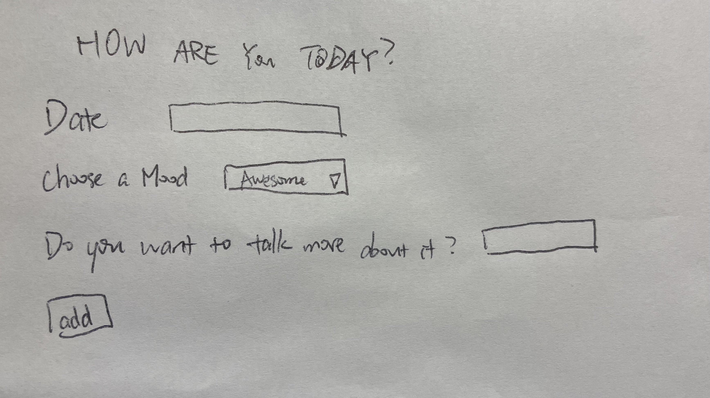
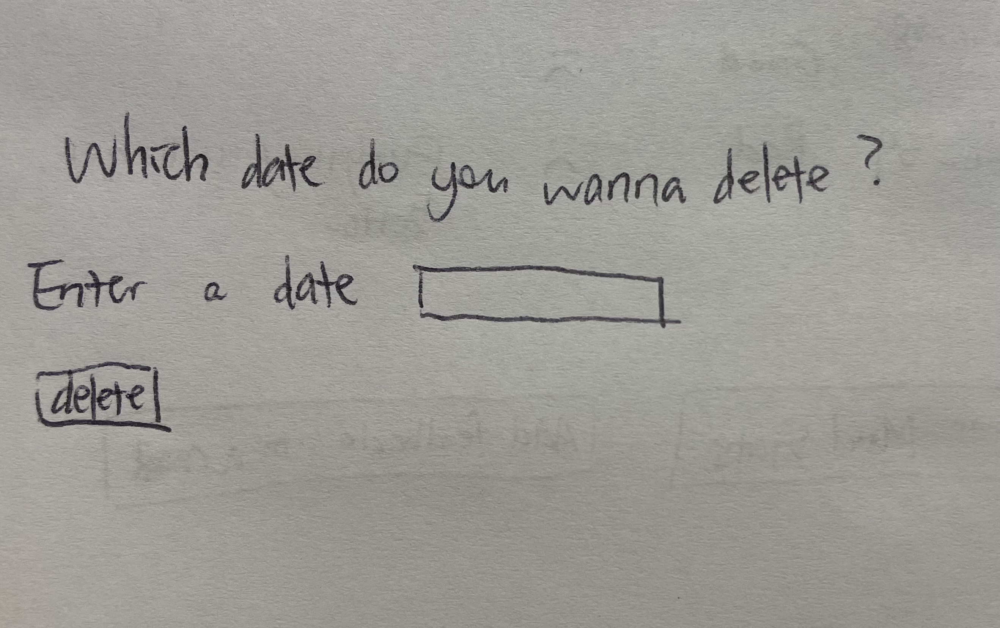
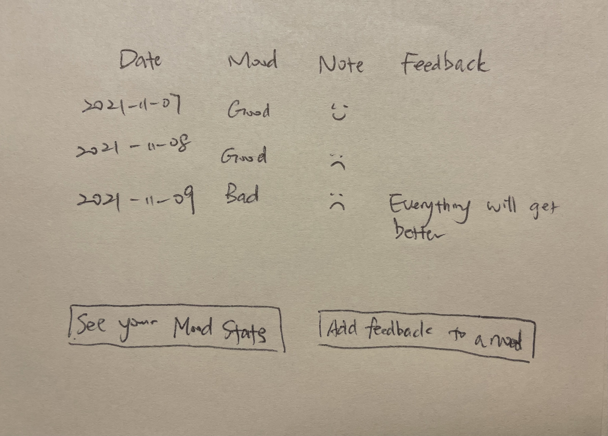
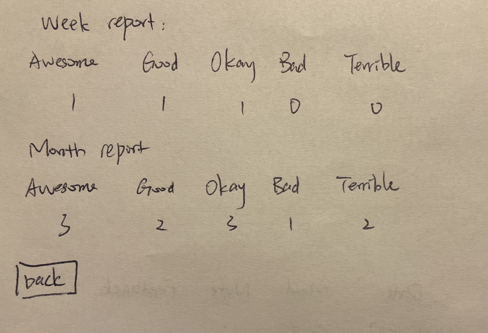
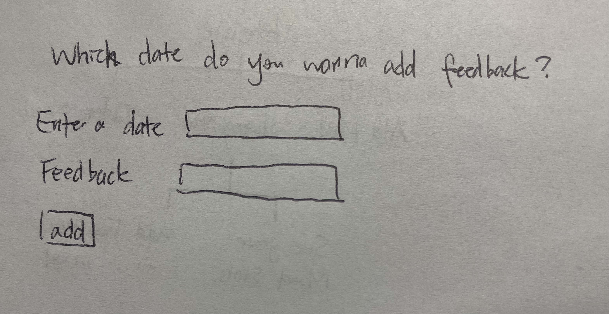

# MyMood

## Overview

Some of us are under huge pressure. It could be hard for us to find a right person to talk to.

MyMood is a web app that will allow users to keep track of the moods. Users can register and login. Once they're logged in, they can add today's mood and leave a note, which they can view or add a feedback to this mood later. Moreover, MyMood can also offer statistics about the moods.


## Data Model

The application will store Users and Moods

* users can have many moods (via references)

An Example User:

```javascript
{
  username: // e.g. user1,
  password: // a password hash,
}
```

An Example Mood with Reference to the User:

```javascript
{
  user: // a reference to a User object
  mtype: //chosen from 'Awesome', 'Good', 'Okay','Bad','Terrible',
  note: // some quick note about the mood,
  createdAt: // timestamp
  feedback: //not available when creating the mood, can be add later
}
```


## [Link to Mongoose Schemas](db.js) 


## Wireframes

/addMood - page for add a mood



/deleteMood - page for add a mood



/historyMood - page for showing all history moods



/historyMood/moodStats - page for showing statistics of history moods



/historyMood/feedback - page for giving feedback to a certain day's mood



## Site map

Here's my [Site Map](MyMood_Site_Map.jpg).

## User Stories or Use Cases

1. as non-registered user, I can register a new account with the site
2. as a user, I can log in to the site
3. as a user, I can add a mood on a specific date and write a note about it
4. as a user, I can view all of the moods I've created
5. as a user, I can add/edit feedback to the mood on a specific day
6. as a user, I can view the statistic of my moods in 7 days/30 days

## Research Topics

(___TODO__: the research topics that you're planning on working on along with their point values... and the total points of research topics listed_)

* (5 points) Automated functional testing for all of the routes
    * I am going to use Selenium
    * Selenium is suitable for automated functional test for web
    * 4 tests
      * login
      * Add a mood
      * View history
      * Delete a mood
    * ## [Automated Test GIF](Selenium_Test.gif) 
* (3 points) Configuration management
    * use dotenv 
    * store database password in configuration
    * store environment variable "NODE_ENV" in configuration

8 points total out of 8 required points


## [Link to Initial Main Project File](app.js) 

## Annotations / References Used

1. [tutorial on dotenv](https://juejin.cn/post/6844903618915598344) - (tutorial for using dotenv)
2. [tutorial on selenium](https://selenium-python.readthedocs.io/) - (for automated functional tests) 